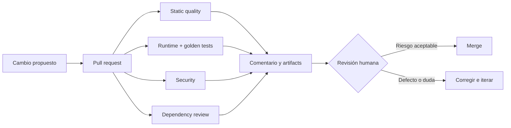

# Guía humana del laboratorio de Quality Engineering e IA

Esta guía existe para explicar el laboratorio frente a un equipo, no para impresionar con una lista de herramientas. La idea central es sencilla: **la automatización produce señales y evidencia; las personas toman decisiones**.

El producto de práctica es Talent Lab, una plataforma sintética de entrevistas. No usa información real y puede ejecutarse completa en local. El repositorio está preparado para mostrar qué pasa cuando un cambio está bien, cuando rompe una expectativa funcional y cuando cambia la interfaz sin actualizar su referencia visual.

## Dónde empezar

- [Repositorio público](https://github.com/SantiagoGuerra/quality-engineering-ai-lab)
- [Ejecuciones de GitHub Actions](https://github.com/SantiagoGuerra/quality-engineering-ai-lab/actions)
- [PRs demostrativos y resultados observados](github/DEMO_PRS.md)
- [Inventario estructurado de herramientas](../config/quality-tools.json)
- [Matriz de evaluación y adopción](tools/evaluation-matrix.md)

Para una exposición, abre primero esta guía y los cuatro PRs demostrativos. El repositorio y los logs sirven como evidencia; el relato debe seguir siendo entendible para alguien que no conozca cada herramienta.

## La historia en un minuto

Una persona propone un cambio mediante un pull request. GitHub ejecuta cuatro gates independientes: calidad estática, comportamiento en runtime, seguridad y revisión de dependencias. Playwright conserva screenshots, videos y trazas cuando algo falla; los golden tests comparan estados importantes de la interfaz; el resto de las herramientas deja reportes descargables. Al final, un comentario único en el PR resume el resultado y documenta el inventario completo de herramientas.

El comentario no aprueba el cambio. Un reviewer revisa el propósito, el riesgo y la evidencia. Si una diferencia visual es intencional, actualiza la referencia en una revisión separada y explica por qué. Si no lo es, corrige el producto.



## Quién hace qué

| Rol                     | Responsabilidad principal                                             | Lo que no debería delegar ciegamente                     |
| ----------------------- | --------------------------------------------------------------------- | -------------------------------------------------------- |
| Product Owner           | Define el comportamiento y el impacto aceptable                       | Aceptación del riesgo de negocio                         |
| Developer               | Implementa, agrega pruebas cercanas al código y explica el cambio     | Confirmar que “compila” significa que “sirve”            |
| QA / Exploratory Tester | Diseña escenarios, explora riesgos no previstos y cuestiona supuestos | Exploración, heurísticas y lectura del contexto          |
| QA Automation Engineer  | Mantiene fixtures, seeds, gates y evidencia reproducible              | Convertir toda señal inestable en un bloqueo             |
| Frontend / Design       | Revisa accesibilidad y cambios visuales intencionales                 | Aprobar un golden nuevo sólo porque el test falló        |
| AppSec                  | Interpreta SAST, DAST, secretos, SBOM y dependencias                  | Tratar cada alerta con la misma severidad real           |
| Platform / SRE          | Mantiene runners, permisos, rendimiento y confiabilidad del pipeline  | Confundir disponibilidad del CI con calidad del producto |
| Reviewer                | Une propósito, código, evidencia y riesgo para decidir                | Hacer merge sólo porque todos los checks están verdes    |
| Asistente de IA         | Propone código, casos y explicaciones; acelera tareas repetibles      | Autoría responsable, aprobación y criterio final         |

En equipos pequeños una persona puede ocupar varios roles. Lo importante es conservar las responsabilidades, no los cargos.

## Qué ocurre en cada workflow

### Pull request: rápido, independiente y explicable

- **Static quality:** build, ESLint, TypeScript, actionlint, unit, componentes, API, propiedades y Storybook.
- **Runtime quality:** aplicación real en contenedores, smoke E2E, accesibilidad, Hurl y golden tests.
- **Security quality:** secretos, SAST, SBOM, vulnerabilidades e infraestructura como código.
- **Dependency review:** impide introducir una dependencia nueva con vulnerabilidad alta o crítica.
- **Quality summary:** usa sólo el checkout confiable de `main`, recoge el resultado de los cuatro gates y actualiza un único comentario.
- **CodeQL:** análisis semántico independiente publicado en Code Scanning.

Los jobs que ejecutan el código del PR sólo tienen permiso de lectura. Únicamente el job final puede escribir el comentario y, antes de hacerlo, usa el script de la revisión base. Los PRs provenientes de forks no reciben permiso de comentario.

`QA_SEED` nombra el escenario de datos (`default`, `empty-state`, etc.); `FC_SEED` reproduce los casos generativos y vale `20260721` en CI. Dependabot recibe un token de sólo lectura: para sus PRs el resumen se guarda como artifact en vez de intentar escribir un comentario.

### Main: cobertura expandida

Después de integrar se ejecutan navegadores adicionales, integración real, suite E2E completa, visuales Linux, fuzzing OpenAPI y DAST. Su objetivo es detectar interacciones más costosas sin volver lento cada ciclo de desarrollo.

### Nightly: profundidad, tendencia y experimentación

Incluye mutación, Lighthouse, Pa11y, carga k6, video/filmstrip de Sitespeed, flaky report y un carril de agentes que nunca bloquea. Aquí caben señales más lentas o variables.

### Manual: una conversación reproducible

Permite elegir ref, seed, suite y navegador. Sirve durante una sesión de triage o una demostración. Jira permanece en `dry-run` hasta que una persona habilita credenciales y mutación explícitamente.

## Screenshots, videos, trazas y golden tests

Sí están incluidos, pero cumplen papeles distintos:

| Evidencia                 | Cuándo se genera           | Para qué sirve                                     | Ubicación                             |
| ------------------------- | -------------------------- | -------------------------------------------------- | ------------------------------------- |
| Golden screenshot         | En cada test `@visual`     | Comparar el estado esperado pixel a pixel          | `tests/e2e/visual.spec.ts-snapshots/` |
| Actual + diff             | Cuando un golden falla     | Ver qué píxeles cambiaron                          | `test-results-linux/` y artifact PR   |
| Screenshot de fallo       | Cuando cualquier E2E falla | Contexto visual inmediato                          | `test-results(-linux)/`               |
| Video Playwright          | Cuando cualquier E2E falla | Reconstruir la secuencia de interacción            | `test-results(-linux)/`               |
| Trace Playwright          | Cuando cualquier E2E falla | DOM, red, consola, acciones y snapshots temporales | `test-results(-linux)/`               |
| Video/filmstrip Sitespeed | En nightly                 | Explicar carga y estabilidad visual                | `reports/generated/sitespeed/`        |
| Replay rrweb sanitizado   | Demo opcional              | Reproducción HTML sin texto sensible               | `reports/generated/playwright/rrweb/` |

Los goldens actuales protegen login desktop y móvil, tabla poblada, estado vacío, error recuperable, modal de creación y rol candidato de sólo lectura. Las respuestas de red están congeladas con datos sintéticos para que un cambio en la base de datos no cambie una imagen.

Comandos útiles:

```bash
pnpm test:visual                    # compara contra el SO actual
pnpm test:visual:update             # actualiza baselines del SO actual
pnpm test:visual:linux              # compara como el runner GitHub
pnpm test:visual:linux:update       # actualiza Linux en imagen Playwright fijada
VISUAL_VARIANT=controlled-difference pnpm test:visual
pnpm exec playwright show-report reports/generated/playwright/html
pnpm exec playwright show-trace test-results/<ruta>/trace.zip
```

Nunca se debe actualizar un golden sólo para obtener verde. Primero se mira `expected`, `actual` y `diff`; luego Frontend/Design o el reviewer confirma si el cambio es correcto. Las referencias Darwin y Linux se versionan por separado porque el rasterizado de fuentes puede variar entre sistemas.

## Cómo leer un fallo durante la exposición

1. Empieza por el comentario del PR: identifica cuál gate falló.
2. Abre el job, no todo el log. La última aserción útil suele explicar el síntoma.
3. Descarga el artifact de ese gate.
4. Si es E2E, abre primero el screenshot y luego el video; usa la traza para red, consola o DOM.
5. Si es visual, compara `expected`, `actual` y `diff` antes de tocar el baseline.
6. Clasifica: defecto de producto, defecto de test, ambiente inestable o cambio aceptado.
7. Escribe la decisión humana y su razón en el PR.

## Dónde entra la IA

La IA puede proponer casos límite, generar una primera versión de un test, resumir logs o sugerir una causa. En este laboratorio sus resultados experimentales nunca son un gate. Toda salida se valida con comandos determinísticos y queda atribuida en el template del PR.

Un uso sano sería: “la IA sugirió tres escenarios; QA eliminó uno irrelevante, convirtió dos en tests reproducibles y revisó la evidencia”. Un uso riesgoso sería: “la IA dijo que el cambio está bien”.

## Guion sugerido para una exposición de 30 minutos

1. **Minutos 0–4:** problema, arquitectura y datos sintéticos.
2. **Minutos 4–8:** ejecutar `pnpm qa:check` y abrir el índice de reportes.
3. **Minutos 8–13:** recorrer un PR verde y su comentario automático.
4. **Minutos 13–18:** abrir el PR rojo unitario, leer el fallo y explicar el gate independiente.
5. **Minutos 18–24:** abrir el PR rojo visual, enseñar expected/actual/diff, video y trace.
6. **Minutos 24–27:** mostrar CodeQL, SBOM, Dependabot y Scorecard.
7. **Minutos 27–30:** roles, límites de IA y preguntas.

Antes de presentar, ejecuta `pnpm qa:doctor`, comprueba Docker y abre las páginas en pestañas. No hagas depender la explicación de una descarga en vivo: los artifacts y los PRs demostrativos quedan preservados como respaldo.

## Inventario y límites honestos

El manifiesto `config/quality-tools.json` es la fuente estructurada del comentario automático. Incluye propósito, comando, tipo de gate, responsable, evidencia, licencia y costo de cada herramienta. Las decisiones de adopción y las alternativas evaluadas están en `docs/tools/evaluation-matrix.md`.

Este es un laboratorio, no una certificación. Lighthouse y k6 expresan presupuestos locales, no SLO de producción. Los scanners no prueban ausencia de vulnerabilidades. Los tests de accesibilidad automatizados no reemplazan teclado, lector de pantalla ni revisión cognitiva. Una cobertura alta no demuestra que elegimos los casos correctos.
