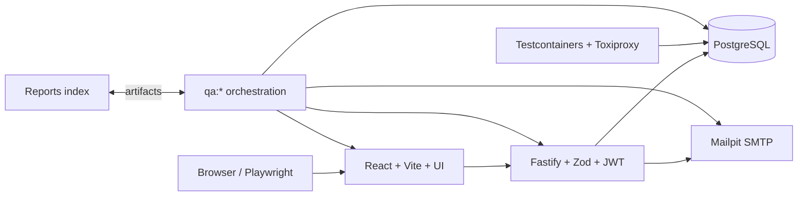

# Arquitectura del sistema

Los contratos Zod y permisos son compartidos; la API mantiene autorización, errores y auditoría; database encapsula PostgreSQL/memoria, migraciones, seed, idempotencia y versiones optimistas. Web no almacena credenciales: mantiene un JWT local corto. Compose enlaza servicios sólo en la red del proyecto y publica puertos en loopback.

Trust boundaries: navegador→API es no confiable; API→DB/SMTP sólo por red interna; fixtures requieren `ENABLE_TEST_FIXTURES`; Jira/scanners son adaptadores externos y no reciben secretos en artifacts. El producto soporta roles Admin, Recruiter, Reviewer y Candidate. Redis no se introduce sin un caso útil.

Errores de producto (respuesta incorrecta reproducible), test (assertion/fixture defectuosa), infraestructura (Docker/puerto/browser) y dependencia (registry/Jira) conservan distinta clasificación. Logs incluyen request ID, nunca password/token.
